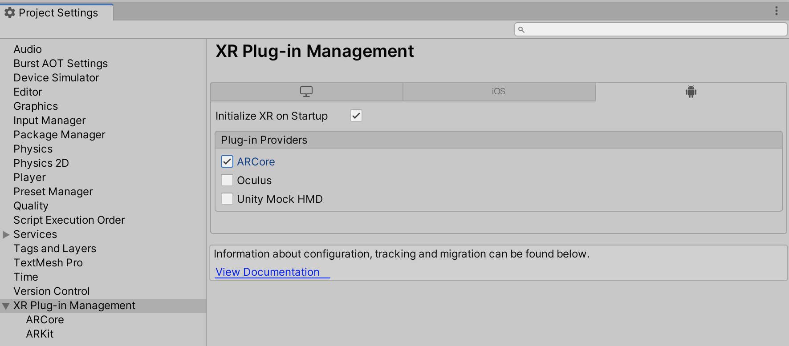
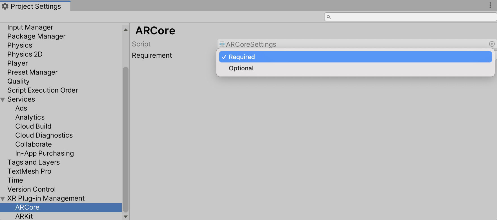

# About ARCore XR Plugin

Use the ARCore XR Plugin package to enable ARCore support via Unity's multi-platform XR API. This package implements the following XR Subsystems:

* [Session](xref:arsubsystems-session-subsystem)
* [Camera](xref:arsubsystems-camera-subsystem)
* [Depth](xref:arsubsystems-depth-subsystem)
* [Input](xref:UnityEngine.XR.XRInputSubsystem)
* [Planes](xref:arsubsystems-plane-subsystem)
* [Raycast](xref:arsubsystems-raycast-subsystem)
* [Anchors](xref:arsubsystems-anchor-subsystem)
* [Face tracking](xref:arsubsystems-face-subsystem)
* [Image tracking](xref:arsubsystems-image-tracking-subsystem)
* [Environment probes](xref:arsubsystems-environment-probe-subsystem)
* [Occlusion](xref:arsubsystems-occlusion-subsystem)

This version of ARCore XR Plugin uses ARCore 1.22 and supports the following functionality:

* Device localization
* Horizontal plane detection
* Vertical plane detection
* Point clouds
* Pass-through camera view
* Light estimation
* Anchors
* Oriented feature points
* Hit testing
* Session management
* ARCore APK on-demand installation
* 2D Image tracking
* Face tracking
* Environment probes
* Occlusion

It doesn't support the following subsystems:

* [Object tracking](xref:arsubsystems-object-tracking-subsystem)
* [Participant](xref:arsubsystems-participant-subsystem)
* [Mesh](xref:arsubsystems-mesh-subsystem)
* [Body tracking](xref:UnityEngine.XR.ARSubsystems.XRHumanBodySubsystem)

# Installing ARCore XR Plugin

To install this package, follow the instructions in the [Package Manager documentation](https://docs.unity3d.com/Packages/com.unity.package-manager-ui@latest/index.html).

In addition, install the AR Foundation package, which uses ARCore XR Plugin and provides many useful scripts and prefabs. For more information about this package, see the [AR Foundation documentation](https://docs.unity3d.com/Packages/com.unity.xr.arfoundation@4.1).

# Using ARCore XR Plugin

The ARCore XR Plugin implements the native endpoints required for building Handheld AR apps targeting Google’s ARCore platform using Unity's multi-platform XR API. However, this package doesn't expose any public scripting interface of its own. In most cases, you should use the scripts, prefabs, and assets provided by AR Foundation as the basis for your Handheld AR apps.

Including the ARCore XR Plugin also includes source files, static libraries, shader files, and plug-in metadata.

## Build Settings

You can flag ARCore XR Plugin as either required or optional.

If ARCore is optional, the Play Store lets users install your app on devices that don't support ARCore, or that support ARCore but don't have it installed. This is useful if you want to provide different alternatives depending on whether AR is available.

AR is required by default.

To create an `ARCoreSettings` Asset and assign it to your build settings, open the Project Settings window (from Unity's main menu, go to **Edit &gt; Project Settings**), then navigate to the **XR Plug-in Management** menu and check the **ARCore** provider, as shown in the screenshot below:



This will create an `ARCoreSettings` Asset that can be accessed under **XR Plug-in Management &gt; ARCore**, as shown in the screenshot below:



**Note:** If ARCore is required, the availability check will always report that ARCore is supported, even on unsupported devices. This is because the Play Store prevents the installation of apps that require ARCore on unsupported devices, so these apps always assume they're running on a supported device. However, if you install an Android APK onto an unsupported device via USB (called "side loading") or via Unity, the unsupported device will report that ARCore is supported.

## Session

ARCore implements `XRSessionSubsystem.GetAvailabilityAsync`. The list of devices ARCore supports is frequently updated to include additional devices. If ARCore isn't already installed on a device, your app needs to check with the Play Store to see if there's a version of ARCore that supports that device. `GetAvailabilityAsync` returns a `Promise` which can be used in a coroutine. For ARCore, this check may take some time.

If the device is supported, but ARCore is not installed (or requires an update), you need to call `XRSessionSubsystem.InstallAsync`, which also returns a `Promise`.

For more information, see the [ARSubsystems session documentation](xref:arsubsystems-session-subsystem).

## Depth subsystem

Raycasts always return a `Pose` for the item the raycast hit. When raycasting against feature points, the pose is oriented to provide an estimate for the surface the feature point might represent.

The depth subsystem doesn't require additional resources, so enabling it doesn't affect performance

ARCore's depth subsystem will only ever produce a single [`XRPointCloud`](xref:UnityEngine.XR.ARSubsystems.XRPointCloud).

For more information, see the [ARSubsystems depth subsystem documentation](xref:arsubsystems-depth-subsystem).

## Plane tracking

ARCore supports plane subsumption (that is, one plane can be included in another). When this happens, the subsumed plane isn't removed, but won't be updated any further.

ARCore provides boundary points for all its planes.

The ARCore plane subsystem requires additional CPU resources and can be energy-intensive. Enabling both horizontal and vertical plane detection requires additional resources. Consider disabling plane detection when your app doesn't need it to save energy.

Setting the plane detection mode to `PlaneDetectionMode.None` is equivalent to `Stop`ping subsystem.

For more information, see the [ARSubsystems plane subsystem documentation](xref:arsubsystems-plane-subsystem).

## Image tracking

To use image tracking on ARCore, you must first create a reference image library. To learn how to do this, see the [AR Subsystems documentation on image tracking](xref:arsubsystems-image-tracking-subsystem).

When building the Player for Android, each reference image library is used to generate a corresponding `imgdb` file, which is how ARCore represents reference image libraries. These files are placed in your project's `StreamingAssets` folder, in a subdirectory called `HiddenARCore`, so they can be accessed at runtime.

ARCore's AR reference images can be either JPEG or PNG files. If a different type of source texture is specified in the `XRReferenceImageLibrary`, the ARCore build processor will attempt to convert the texture to a PNG for ARCore to use. Exporting a `Texture2D` to PNG can fail for several reasons. For example -  the texture must be marked both readable and uncompressed in the texture importer settings. If you plan to use the texture at runtime (and not just as a source Asset for the reference image), you should create a separate PNG or JPEG as the source Asset, because those texture import settings can negatively affect performance or memory at runtime.

### Reference image dimensions

Image dimensions are optional on ARCore; however, specifying them can improve image detection. If you specify the dimensions for a reference image, ARCore only receives the image's width, and then computes the height from the image's aspect ratio.

## Face tracking

For information about face tracking, see the [ARSubsystems Face Tracking](xref:arsubsystems-face-subsystem) documentation.

In addition to the core functionality, the ARCore face subsystem has methods that allow access to ARCore-specific features. ARCore provides access to regions, which are specific features on a face. Currently, these features are:

- Nose tip
- Forehead left
- Forehead right

Each region has a [Pose](xref:UnityEngine.Pose) associated with it. To access face regions, you need to obtain an instance of the [ARCoreFaceSubsystem](xref:UnityEngine.XR.ARCore.ARCoreFaceSubsystem):

```csharp
XRFaceSubsystem faceSubsystem = ...
#if UNITY_ANDROID
var arcoreFaceSubsystem = faceSubsystem as ARCoreFaceSubsystem;
if (arcoreFaceSubsystem != null)
{
    var regionData = new NativeArray<ARCoreFaceRegionData>(0, Allocator.Temp);
    arcoreFaceSubsystem.GetRegionPoses(faceId, Allocator.Temp, ref regionData);
    using (regionData)
    {
        foreach (var data in regionData)
        {
            Debug.LogFormat("Region {0} is at {1}", data.region, data.pose);
        }
    }
}
#endif
```

## Light estimation

ARCore light estimation has two modes of operation: `LightEstimationMode.AmbientIntensity` and `LightEstimationMode.EnvironmentalHDR`. `LightEstimationMode.AmbientIntensity` providers color correction and average pixel intensity information, while `LightEstimationMode.EnvironmentalHDR` provides an estimated Main Light Direction, HDR Color, and the ambient SphericalHarmonicsL2 (see [SphericalHarmonicsL2](https://docs.unity3d.com/ScriptReference/Rendering.SphericalHarmonicsL2.html) for more information on Spherical Harmonics). The two modes can't be used simultaneously.

Additionally, the light estimation modes are either used or affected by other subsystems, namely the [ARCoreFaceSubsystem](xref:UnityEngine.XR.ARCore.ARCoreFaceSubsystem) and ARCore's [EnvironmentProbeSubsystem](xref:UnityEngine.XR.ARSubsystems.XREnvironmentProbeSubsystem).  If one or both of these subsystems is present and `enabled`, the light estimation mode will have its behaviour modified depending on the configuration.

| Functionality      | Supported light estimation modes                                       | Modifiable |
|--------------------|------------------------------------------------------------------------|------------|
| Face tracking      | `LightEstimationMode.AmbientIntensity`, `LightEstimationMode.Disabled` | Yes        |
| Environment probes | `LightEstimationMode.EnvironmentalHDR`                                 | No         |

* Face tracking: ARCore doesn't support `LightEstimationMode.EnvironmentalHDR` while face tracking and rendering won't work if that mode is specified. To prevent this, the providers only allow `LightEstimationMode.AmbientIntensity` or `LightEstimationMode.Disabled` modes to be set while tracking faces or it will enforce `LightEstimationMode.Disabled`.

* Environment probes: ARCore environment probes rely on the light estimation mode being `LightEstimationMode.EnvironmentalHDR` to surface and update the cubemap, and therefore take ownership of the setting.

## Camera configuration

[XRCameraConfiguration](xref:UnityEngine.XR.ARSubsystems.XRCameraConfiguration) contains an `IntPtr` field `nativeConfigurationHandle`, which is a platform-specific handle. For ARCore, this handle is the pointer to the `ArCameraConfiguration`. The native object is managed by Unity and should not be manually destroyed.

## Occlusion

The ARCore implementation of [XROcclusionSubsystem](xref:arsubsystems-occlusion-subsystem) supports [Environment Depth Texture](https://docs.unity3d.com/Packages/com.unity.xr.arfoundation@4.1/api/UnityEngine.XR.ARFoundation.AROcclusionManager.html#UnityEngine_XR_ARFoundation_AROcclusionManager_environmentDepthTexture) but does not support the other textures related to human segmentation.

# Technical details

## Requirements

This version of ARCore XR Plugin is compatible with the following versions of the Unity Editor:

* 2019.4.15f1
* 2020.3
* 2021.1
* 2021.2

## Known limitations

* The **AR Core Supported** setting in the XR Settings section of the Android Player settings must remain disabled in order for apps built with the ARCore XR Plugin to work properly.
* Color Temperature in degrees Kelvin is not presently supported.
* Due to changes made in Google's ARCore client libraries which are redistributed in ARCore XR Plugin, projects built with Unity 2019.4 must be updated to use Gradle 5.6.4 or later. Please [refer to these instructions](https://developers.google.com/ar/develop/unity/android-11-build#unity_20193_20194_and_20201) for updating your project's Gradle version.
* The [XROcclusionSubsystemDescriptor](xref:UnityEngine.XR.ARSubsystems.XROcclusionSubsystemDescriptor) properties [supportsEnvironmentDepthImage](xref:UnityEngine.XR.ARSubsystems.XROcclusionSubsystemDescriptor.supportsEnvironmentDepthImage) and [supportsEnvironmentDepthConfidenceImage](xref:UnityEngine.XR.ARSubsystems.XROcclusionSubsystemDescriptor.supportsEnvironmentDepthConfidenceImage) require a session before support can be determined. If there is no session, then these properties will return `false`. They may later return `true` when a session has been established.

## Package contents

This version of ARCore XR Plugin includes:

* A shared library which provides implementation of the XR Subsystems listed above
* A shader used for rendering the camera image
* A plugin metadata file
