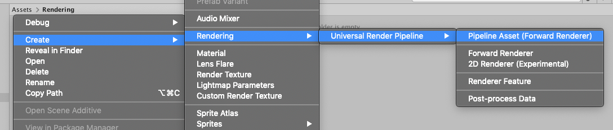
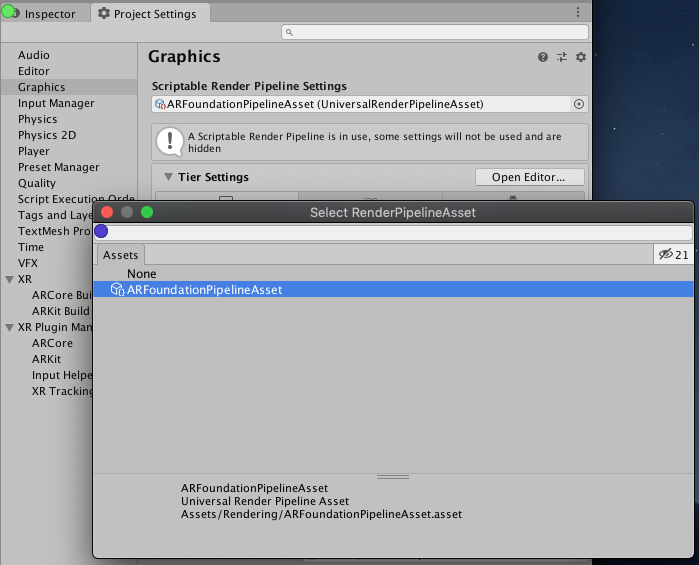

# Configuring the AR Camera background using a Scriptable Render Pipeline

AR Foundation supports the Universal Render Pipeline (URP) versions 7.0.0 or later. See the [URP Install and Configure documentation](https://docs.unity3d.com/Packages/com.unity.render-pipelines.universal@latest?subfolder=/manual/InstallingAndConfiguringURP.html) for more details on switching to URP.

**Note:** Projects made using URP are not compatible with the High Definition Render Pipeline or the built-in Unity rendering pipeline. Before you start development, you must decide which render pipeline to use in your Project.

## Basic URP configuration for AR Foundation

### Set up URP Render Pipeline Asset

**Note:** The following basic steps for URP setup are not specific to AR Foundation and are included to indicate how to convert a legacy AR Foundation Project into a URP AR Foundation Project. If your Project was created from the [URP Project Template](https://docs.unity3d.com/Packages/com.unity.render-pipelines.universal@7.1/manual/creating-a-new-project-with-urp.html) or already you have a `UniversalRenderPipelineAsset` and `Pipeline Asset (Forward Renderer)` in your Project, [skip to the next section](#configuring-urp-to-work-with-arfoundation).

To use the Universal Rendering Pipeline, you must create a `Pipeline Asset`. Follow these steps:

1. In the Project's `Assets` folder, create a new folder named `Rendering`.
   
2. In the `Rendering` folder, create a Pipeline Asset (Forward Renderer) for URP:
    Right-click anywhere in the folder and select **Create &gt; Rendering &gt; Universal Render Pipeline &gt; Pipeline Asset (Forward Renderer)**.
    This creates two Assets:
    * An [UniversalRenderPipelineAsset](https://docs.unity3d.com/Packages/com.unity.render-pipelines.universal@latest?subfolder=/api/UnityEngine.Rendering.Universal.UniversalRenderPipelineAsset.html)
    * A [ForwardRenderer](https://docs.unity3d.com/Packages/com.unity.render-pipelines.universal@latest?subfolder=/api/UnityEngine.Rendering.Universal.ForwardRenderer.html)
   

### Configuring URP to work with ARFoundation

After you created a `Pipeline Asset`, you can configure the asset to work with AR Foundation. Follow these steps:

1. Locate your `Forward Renderer` asset. If you created your Project from the [URP Project Template](https://docs.unity3d.com/Packages/com.unity.render-pipelines.universal@7.1/manual/creating-a-new-project-with-urp.html) then this will be located in the `Settings` folder in your Project's `Assets` folder.
2. Select your `Forward Renderer` asset. In its Inspector, add an `ARBackgroundRendererFeature` to the list of Renderer Features.
   
3. Access the Graphics section of the Project Settings window (menu: **Edit &gt; Project Settings**, then select **Graphics**), and select the `UniversalRenderPipelineAsset` for the **Scriptable Render Pipeline Settings** field.
   
