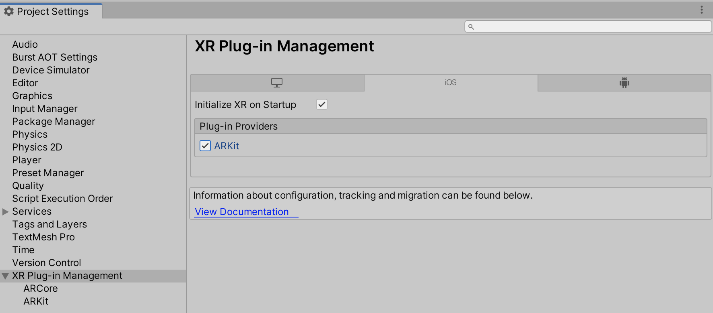
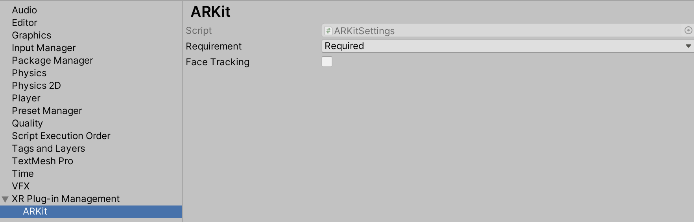
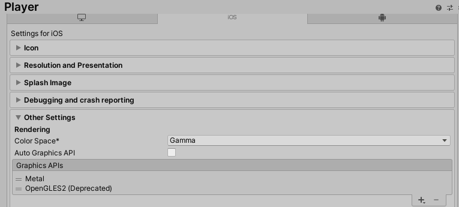
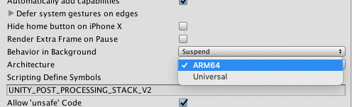

# About ARKit XR Plugin

Use the ARKit XR Plugin package to enable ARKit support via Unity's multi-platform XR API. This package implements the following XR Subsystems:

* [Session](xref:arsubsystems-session-subsystem)
* [Camera](xref:arsubsystems-camera-subsystem)
* [Depth](xref:arsubsystems-depth-subsystem)
* [Input](xref:UnityEngine.XR.XRInputSubsystem)
* [Planes](xref:arsubsystems-plane-subsystem)
* [Raycast](xref:arsubsystems-raycast-subsystem)
* [Anchors](xref:arsubsystems-anchor-subsystem)
* [Image tracking](xref:arsubsystems-image-tracking-subsystem)
* [Environment probes](xref:arsubsystems-environment-probe-subsystem)
* [Body tracking](xref:UnityEngine.XR.ARSubsystems.XRHumanBodySubsystem)
* [Occlusion](xref:arsubsystems-occlusion-subsystem)
* [Participant](xref:arsubsystems-participant-subsystem)
* [Meshes](xref:arsubsystems-mesh-subsystem)

This version of ARKit XR Plugin supports the following features:

* Device localization
* Horizontal plane detection
* Vertical plane detection
* Point clouds
* Pass-through camera view
* Light estimation
* Anchors
* Hit testing
* Session management
* Image tracking
* Object tracking
* Environment probes
* Participant tracking
* Meshes (also known as Scene Reconstruction)
* Occlusion

Apple's App Store will reject any app that contains certain face tracking-related symbols in its binary if the app developer doesn't intend to use face tracking. To avoid ambiguity, [face tracking](xref:arsubsystems-face-subsystem) support is available in a separate package, [ARKit Face Tracking](https://docs.unity3d.com/Packages/com.unity.xr.arkit-face-tracking@4.1).

# Installing ARKit XR Plugin

To install this package, follow the instructions in the [Package Manager documentation](https://docs.unity3d.com/Packages/com.unity.package-manager-ui@latest/index.html).

In addition, install the AR Foundation package, which uses ARKit XR Plugin and provides many useful scripts and prefabs. For more information about this package, see the [AR Foundation documentation](https://docs.unity3d.com/Packages/com.unity.xr.arfoundation@latest).

# Using ARKit XR Plugin

The ARKit XR Plugin implements the native iOS endpoints required for building Handheld AR apps using Unity's multi-platform XR API. However, this package doesn't expose any public scripting interface of its own. In most cases, you should use the scripts, prefabs, and assets provided by AR Foundation as the basis for your Handheld AR apps.

Including the ARKit XR Plugin also includes source files, static libraries, shader files, and plug-in metadata.

ARKit requires iOS 11.0. Some specific features require later versions (see below).

## Build settings

To access ARKit build settings, from Unity's main menu, go to **Edit &gt; Project Settings**, then navigate to the **XR Plug-in Management** menu and check the **ARKit** provider, as shown in the screenshot below:

This will create an `ARKitSettings` Asset that can be accessed under **XR Plug-in Management &gt; ARKit**, as shown in the screenshot below:

### Requiring AR

You can flag ARKit as either required or optional. By default, ARKit is required, which means your app can ony be installed on AR-supported devices and operating systems (iOS 11.0 and above). If you specify that AR is optional, your app can be installed on all iOS devices.

#### Targeting 32-bit Devices

To target 32-bit devices _OpenGLES2_ must be included in the list of Graphics APIs. From the menu, choose _Edit > Project Settings_ then navigate to _Player > Other Settings > Graphics APIs_:

## Session

ARKit implements [XRSessionSubsystem.GetAvailabilityAsync](xref:UnityEngine.XR.ARSubsystems.XRSessionSubsystem.GetAvailabilityAsync), which consists of the device checking that it's running on iOS 11.0 or above. For more information, see the [ARSubsystems session documentation](xref:arsubsystems-session-subsystem).

## Depth subsystem

Raycasts always return a `Pose` for the item the raycast hit. When raycasting against feature points, the pose is oriented to provide an estimate for the surface the feature point might represent.

The depth subsystem doesn't require additional resources, so enabling it doesn't affect performance

ARKit's depth subsystem will only ever produce a single [XRPointCloud](xref:UnityEngine.XR.ARSubsystems.XRPointCloud).

For more information, see the [ARSubsystems depth subsystem documentation](xref:arsubsystems-depth-subsystem).

## Plane tracking

ARKit doesn't support plane subsumption (that is, one plane can't be included in another plane); there is no merge event. If two planes are determined to be separate parts of the same surface, one plane might be removed while the other expands to the explored surface.

ARKit provides boundary points for all its planes on iOS 11.3 and later.

The ARKit plane subsystem requires additional CPU resources and can be energy-intensive. Enabling both horizontal and vertical plane detection (available in iOS 11.3+) requires additional resources. Consider disabling plane detection when your app doesn't need it to save energy.

Setting the plane detection mode to [PlaneDetectionMode.None](xref:UnityEngine.XR.ARSubsystems.PlaneDetectionMode.None) is equivalent to `Stop`ping subsystem.

For more information, see the [ARSubsystems plane subsystem documentation](xref:arsubsystems-plane-subsystem).

## Participant tracking

A participant represents another device in a multi-user collaborative session. Although you can start and stop the participant subsystem at any time, the session must receive `ARCollaborationData` from other peers in the multi-user session in order for participants to be detected. For an example implementation, see the [ARCollaborationData sample on GitHub](https://github.com/Unity-Technologies/arfoundation-samples/tree/master/Assets/Scenes/ARCollaborationData).

## Light estimation

ARKit light estimation can only be `enabled` or `disabled`. The availability of either  `Ambient Intensity` or `Environmental HDR` data is governed by the active tracking mode. See the following table for more details.

| Tracking configuration | Ambient intensity (lumens) | Color temperature | Main light direction | Main light intensity (lumens) | Ambient spherical harmonics |
|------------------------|----------------------------|-------------------|----------------------|-------------------------------|-----------------------------|
| World Tracking         | Yes                        | Yes               | No                   | No                            | No                          |
| Face Tracking          | Yes                        | Yes               | Yes                  | Yes                           | Yes                         |

## Camera configuration

[XRCameraConfiguration](xref:UnityEngine.XR.ARSubsystems.XRCameraConfiguration) contains an `IntPtr` field `nativeConfigurationHandle` which is a platform-specific handle. For ARKit, this handle is a pointer to the native [ARVideoFormat](https://developer.apple.com/documentation/arkit/arvideoformat?language=objc) Objective-C object.

# Technical details

## Requirements

This version of ARKit XR Plugin is compatible with the following versions of the Unity Editor:

* 2019.4.15f1
* 2020.3
* 2021.1
* 2021.2

## Known limitations

* Color correction is not available as an RGB Value (only as color temperature).
* This package only supports 64-bit devices. In the Player Settings window for iOS (menu: **Edit &gt; Project Settings &gt; Player Settings**, then select iOS), you need to select ARM64 as the target Architecture (the default is Universal).

## Package contents

This version of ARKit XR Plugin includes:

* A static library which provides implementation of the XR Subsystems listed above
* An Objective-C source file
* A shader used for rendering the camera image
* A plugin metadata file
